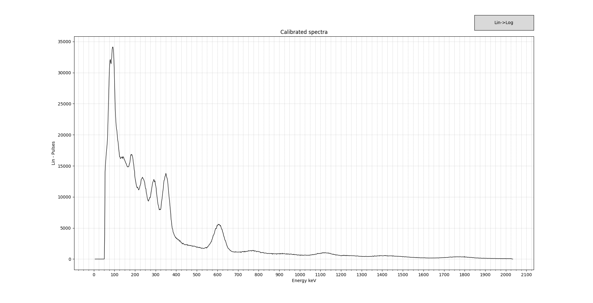
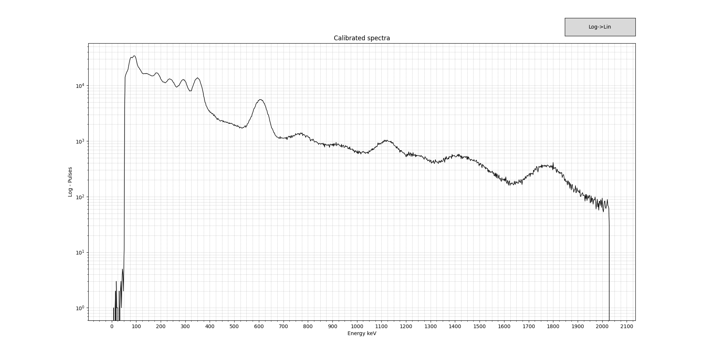
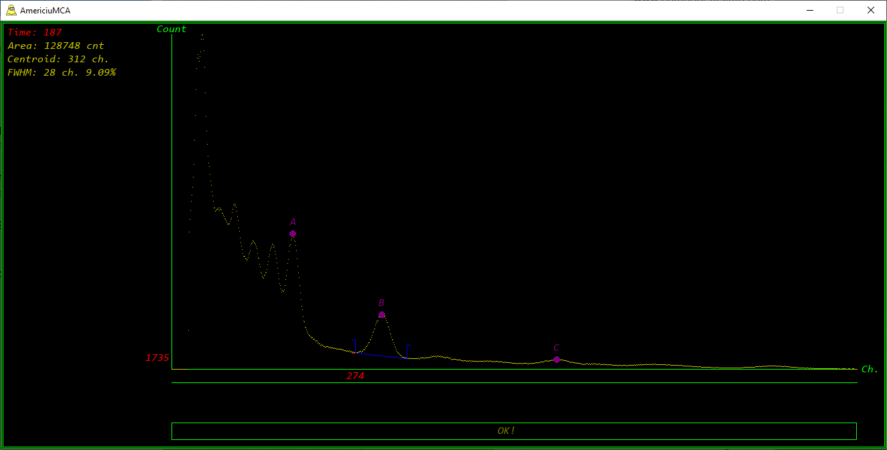

<!DOCTYPE html>
<html lang="en">
  <head>
    <meta http-equiv="content-type" content="text/html; charset=UTF-8">
    <meta name="author" content="Papadopol Lucian Ioan">
  </head>
  <body>
    <h1 style="text-align: center;"><b>AmericiuMCA</b></h1>
    

    <h4>DESCRIPTION</h4>
    
AmericiuMCA is a software that implements multi-channel analyzer
      functionality for gamma ray spectroscopy purposes.

    
Its main goal is providing to the user the possibility to use different
      hardware for pulse acquisition and have a single, fast 

    
software MCA. 

    
At this current development stage, it disclose the power of the Canberra
      556AIM NIM ADC to Ethernet acquisition module via EPICS + MCA package
      connectivity.

    <h4>REQUIREMENTS</h4>
    
It's required to have a NIM BIN system set up for gamma spectroscopy with
      Camberra 556AIM module.

    
The 556AIM is accessed by EPICS package via mca module. It's mandatory to
      have EPICS + mca module correctly installed and configured.

    
You can find here a complete guide to how to do that. <a href="http://www.nuclearphysicslab.com/npl/npl-home/spectroscopy/software_and_hardware/diy-canberra-system/">Nuclear
        Physiscs Lab - Amateur Canberra Spectroscopy</a>

    <h4>SOFTWARE REQUIREMENTS</h4>
    
AmericiuMCA is written in python and uses various extensions. You need to
      have installed python interpreter and the following extensions:

    <ul>
      <li>pygame</li>
      <li>numpy</li>
      <li>matplotlib</li>
      <li>pyepics</li>
    </ul>
    
Installation of this extensions is straightforward using "pip":

    <ul>
      <li>
          <meta http-equiv="content-type" content="text/html; charset=utf-8">
          <tt>pip install pyepics pygame numpy matplotlib</tt></li>
    </ul>
    <h4>HOW TO EXECUTE 
      </h4>
    
After downloading the latest version from GitHub repository, unpack it
      in.

    
To put in execution the software, use your command line shell, move in to
      the folder where you have unpacked it and execute by typing 

    <ul>
      <li><tt><tt>python main.py</tt></tt></li>
    </ul>
    <h4>INTERFACE</h4>
    
The user interface is minimalist and takes advantage of it to speed up
      the operation of the software.

    
Commands are typed directly by keyboard without the need of any clicking
      around.

    
Mouse wheel is used to move main vertical red cursor by one channel
      increment/decrements.

    
Keyboard arrows left and right are used for the same porpoise but with
      ten channel increment/decrements.

    
<h5>COMMANDS</h5>

    <ul>
      <li>start&nbsp;&nbsp;&nbsp;&nbsp;&nbsp;&nbsp; starts the acquisition&nbsp;
        but prior it resets/cancels the previously acquired spectra / 556AIM
        memory</li>
      <li>stop &nbsp; &nbsp; &nbsp;&nbsp; stops the acquisition</li>
      <li>resume&nbsp;&nbsp; resume the acquisition without altering previously
        acquired spectra / 556AIM memory</li>
      <li>plt&nbsp;&nbsp;&nbsp;&nbsp;&nbsp;&nbsp;&nbsp;&nbsp;&nbsp;&nbsp; plot
        the linearity chart</li>
      <li>plot&nbsp;&nbsp;&nbsp;&nbsp;&nbsp;&nbsp;&nbsp;&nbsp; plot the
        calibrated spectra</li>
       <li>printraw&nbsp;&nbsp;&nbsp;&nbsp;&nbsp;&nbsp;&nbsp;&nbsp; print as *.pdf the raw
       spectra data</li>
    </ul>
    
<h5>SHORTCUTS</h5>

    <ul>
      <li>Ctrl + a&nbsp;&nbsp;&nbsp; set calibration marker A on channel
        selected by main cursor</li>
      <li>Ctrl + b&nbsp;&nbsp;&nbsp; set calibration marker B on channel
        selected by main cursor</li>
      <li>Ctrl + c&nbsp;&nbsp;&nbsp; set calibration marker C on channel
        selected by main cursor</li>
      <li>Ctrl + x&nbsp;&nbsp;&nbsp; cancel peak selection markers</li>
      <li>Ctrl + j&nbsp;&nbsp;&nbsp; cancel calibration points A, B, C markers</li>
      <li>Ctrl + l&nbsp;&nbsp;&nbsp; set left peak skirt point for peak
        selection</li>
      <li>Ctrl + r&nbsp;&nbsp;&nbsp; set right peak skirt point for peak
        selection</li>
    </ul>
    
<h5>LIN/LOG SCALE</h5>

    The main window alias "working window", have as per default linear scale. 
    All the operations, calibration, FWHM measure etc... are performed in this window. 
    The logarithmic scale is only available after energy calibration on the secondary windows "Calibrated spectra" that is called
    with the command "plot" 
    

    This is standard linear scale of the plot shown after issuing the command "plot". 
    Clicking on the button on the top right you can switch to logarithmic scale. 
    

         
    
<h5>ENERGY CALIBRATION</h5>

    AmericiuMCA have implemented quadratic fitting energy calibration. To calibrate a spectra you need to clearly recognize three isotope peaks and
    already know their energy. 
    Use the keyboard arrows or mouse wheel to select first, lowest energy isotope peak tip. Type the energy in keV without pressing "Enter",
    press Ctrl + a. A purple calibration marker labelled "A" will appear. Continue with the middle energy peak and Ctrl + B then for the highest enery peak and Ctrl + C.  
    Now that you have set the three calibration points, you can show the linearity of your probe plot by typing command "plt". 
    To show energy calibrated spectra issue the command "plot". 
    The shortcut Ctrl + j resets the three calibration points.  
    

    <h4><b>LICENCE 
      </b></h4>
    <pre><meta http-equiv="content-type" content="text/html; charset=utf-8"><pre>Copyright (c) 2023, Papadopol Lucian Ioan
All rights reserved. Contact: l.i.papadopol "@" gmail.com

Redistribution and use in source and binary forms, with or without
modification, are permitted provided that the following conditions are met:
1. Redistributions of source code must retain the above copyright
   notice, this list of conditions and the following disclaimer.
2. Redistributions in binary form must reproduce the above copyright
   notice, this list of conditions and the following disclaimer in the
   documentation and/or other materials provided with the distribution.
3. All advertising materials mentioning features or use of this software
   must display the following acknowledgement:
   This product includes software developed by the &lt;organization&gt;.
4. Neither the name AmericiuMCA / Papadopol Lucian Ioan / Madexp nor the
   names of its contributors may be used to endorse or promote products
   derived from this software without specific prior written permission.

THIS SOFTWARE IS PROVIDED BY PAPADOPOL LUCIAN IOAN ''AS IS'' AND ANY
EXPRESS OR IMPLIED WARRANTIES, INCLUDING, BUT NOT LIMITED TO, THE IMPLIED
WARRANTIES OF MERCHANTABILITY AND FITNESS FOR A PARTICULAR PURPOSE ARE
DISCLAIMED. IN NO EVENT SHALL PAPADOPOL LUCIAN IOAN BE LIABLE FOR ANY
DIRECT, INDIRECT, INCIDENTAL, SPECIAL, EXEMPLARY, OR CONSEQUENTIAL DAMAGES
(INCLUDING, BUT NOT LIMITED TO, PROCUREMENT OF SUBSTITUTE GOODS OR SERVICES;
LOSS OF USE, DATA, OR PROFITS; OR BUSINESS INTERRUPTION) HOWEVER CAUSED AND
ON ANY THEORY OF LIABILITY, WHETHER IN CONTRACT, STRICT LIABILITY, OR TORT
(INCLUDING NEGLIGENCE OR OTHERWISE) ARISING IN ANY WAY OUT OF THE USE OF THIS
SOFTWARE, EVEN IF ADVISED OF THE POSSIBILITY OF SUCH DAMAGE.</pre></pre>
  </body>
</html>
